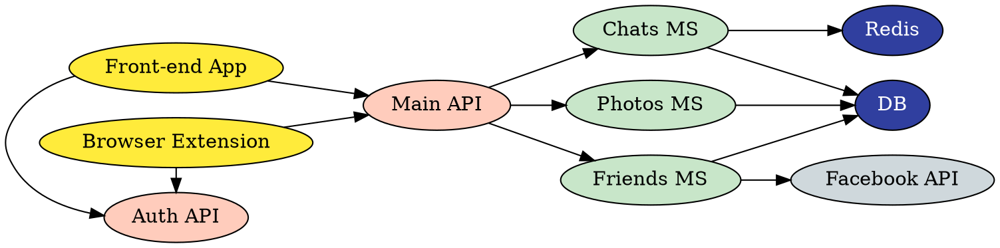

### Websites

* Simple but very useful website to format Markdown tables -> http://markdowntable.com

* Publishing blog/documentation using MKdocs -> https://github.com/tiangolo/dockerswarm.rocks

https://awslabs.github.io/smithy/quickstart.html
* Smithy is an interface definition language and set of tools that allows developers to build clients and servers in multiple languages.

* Alfred update script -> https://github.com/sballin/alfred-search-notes-app/blob/master/update.py

* PlantUml Cheat Sheet -> https://ogom.github.io/draw_uml/plantuml/

* The Cyber Swiss Army Knife - a web app for encryption, encoding, compression and data analysis -> https://gchq.github.io/CyberChef/

* Http3 Book -> https://http3-explained.haxx.se/en/

* Whiteboard cleaner script -> https://gist.github.com/lelandbatey/8677901#description
```shell
#!/bin/bash
convert "$1" -morphology Convolve DoG:15,100,0 -negate -normalize -blur 0x1 -channel RBG -level 60%,91%,0.1 "$2"

# eg. ./whiteboardClean.sh example1.jpg output1.png
```
Applescript droplet -> paste this into a new script and save it as an application -> https://gist.github.com/lelandbatey/8677901#gistcomment-1205710
```applescript
on open thefiles
  repeat with thefile in thefiles
    set finalpath to POSIX path of thefile
    do shell script "mktemp -t image"
    set temppath to the result
    set success to false
    try
      do shell script "/usr/local/bin/convert '" & finalpath & "' -morphology Convolve DoG:15,100,0 -negate -normalize -blur 0x1 -channel RBG -level 60%,91%,0.1 '" & temppath & "'"
      set success to true
    on error theerror
      display dialog "Conversion failed: " & theerror
    end try
    if success then
      do shell script "mv '" & temppath & "' '" & finalpath & "'"
      display notification "Converted " & finalpath
    end if
  end repeat
end open
```

Convert to SVG using http://autotrace.sourceforge.net/ -> https://gist.github.com/lelandbatey/8677901#gistcomment-1205798
```shell
./autotrace \
  --dpi 1024 \
  --line-threshold 0.1 \
  --color-count 16 \
  --corner-always-threshold 60 \
  --line-reversion-threshold 0.1 \
  --width-weight-factor 0.1 \
  --despeckle-level 10 \
  --despeckle-tightness 5 \
  --preserve-width \
  --remove-adjacent-corners \
  --output-format svg \
  --output-file out.svg \
  in.png
```
Also check https://mzucker.github.io/2016/09/20/noteshrink.html
https://github.com/santhalakshminarayana/whiteboard-image-enhance

* Learn by doing -> https://tryenlight.github.io/

* Split user stories ruthlessly -> https://mikeborozdin.com/post/split-user-stories-get-value-early/

* Using GraphViz to view Microservices -> https://gist.github.com/vladgolubev/80c5523336ddec3859c0e90d9a070882


* Teach tech with cartoons -> https://jvns.ca/teach-tech-with-cartoons/

* GraphViz to draw reverse proxy flow -> https://github.com/mricon/rev-proxy-grapher


### Blog posts

* Side-projects on Google Cloud Run -> https://alexolivier.me/posts/deploy-container-stateless-cheap-google-cloud-run-serverless

* Lunr.js search on Hugo -> https://palant.info/2020/06/04/the-easier-way-to-use-lunr-search-with-hugo/

### Notes
* URI Encoding: How `:` becomes `%3A` using [Percent Encoding](https://en.wikipedia.org/wiki/Percent-encoding)

We start with finding the ASCII value of `:` which is `58`. 
See [ASCII table](https://theasciicode.com.ar/ascii-printable-characters/colon-ascii-code-58.html)

Convert 58 to binary using Short division by Two with Reminder. 
i.e. Divide the answer by 2 and keeping the reminder which will be the binary form.

```
58/2 = 29 => Reminder 0
29/2 = 14 => Reminder 1
14/2 = 7  => Reminder 0
7/2  = 3  => Reminder 1
3/2  = 1  => Reminder 1
1/2  = na => Reminder 1
```

So the binary form is `111010` if we line up all the reminders
Padding the output will make it `00111010`.

Convert the binary into two parts of 4 bits each.

`0011` `1010`

Using the following Hex table conversion, we map `0011` => 3 and `1010` to A which becomes `3A`. 

| Decimal | Binary | Hex |
|---------|--------|-----|
| 1       | 0001   | 1   |
| 2       | 0010   | 2   |
| 3       | 0011   | 3   |
| 4       | 0100   | 4   |
| 5       | 0101   | 5   |
| 6       | 0110   | 6   |
| 7       | 0111   | 7   |
| 8       | 1000   | 8   |
| 9       | 1001   | 9   |
| 10      | 1010   | A   |
| 11      | 1011   | B   |
| 12      | 1100   | C   |
| 13      | 1101   | D   |
| 14      | 1110   | E   |
| 15      | 1111   | F   |

The final part is to prefix it with `%` (which is the escape character) makes it `%3A`
