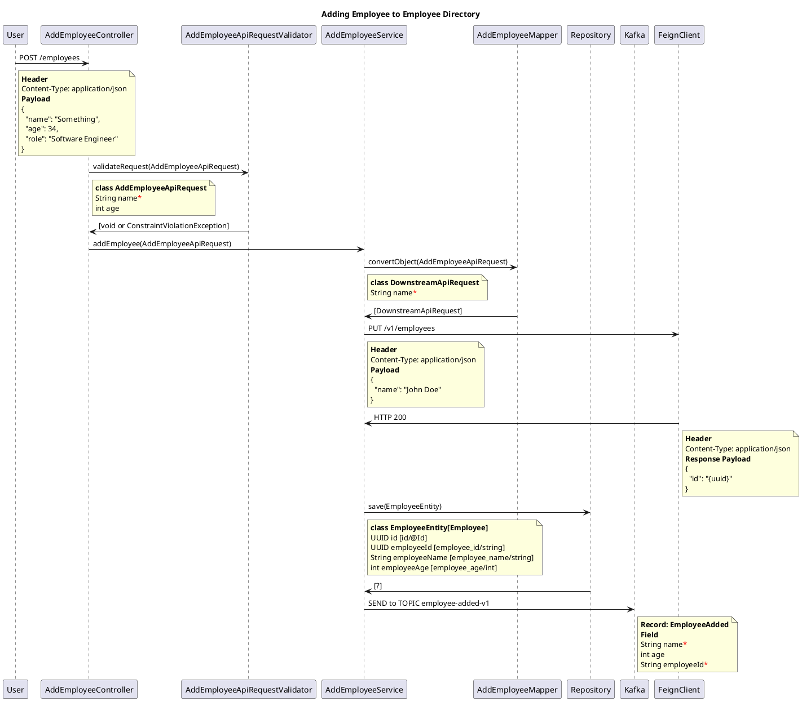

+++
date = 2021-12-26T09:50:56
title = "Implementing Features with Microservices Architecture"
description = ""
slug = ""
tags = ["ideas"]
externalLink = ""
series = ["ideas"]
+++
        
An ongoing thought process on how to help with generating code when working on a microservices based architecture.

In most organisations I worked with, the usual microservices development model is *roughly* divided into two main parts.

### 1. Common Functionality

We can classify the following responsibilities as common across multiple micro services

* Build and deployment pipeline
* Logging destination and output
* Environment Configuration
* Publishing metrics
* Tracing across multiple services
* API request/response formats
* Handling Idempotency where applicable

All of these will feed into different architectural concerns where it is important to have consistency across multiple microservices. Hopefully these will be defined once and rarely change over time.

### 2. Domain Specific Functionality

In addition to the common functionality above, the following things are usually required when adding a new feature.

* Define API route
* Define API request input parameters
* Define/Validate API input parameters
* Define schemas for messaging
* Call external services. It could be over JSON/SOAP based webservices or Kafka/JMS for asynchronous processing
* Define schemas/migration scripts for database entities
* Call database for CRUD operations
* Format successful/error API responses
* Unit tests
* Component test with embedded databases and mocked stubs
* Generating API documentation

A common implementation of a use case is defined as a sequence diagram here.

<!---

--->

