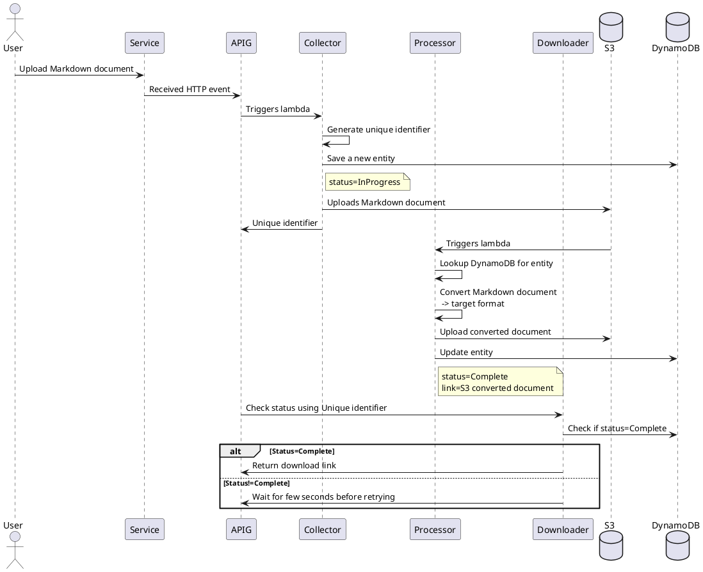

+++
date = 2021-12-26T09:56:42
title = "[SaaS Idea] Markdown to ... converter"
description = "Online service to convert Markdown to PDF / Confluence / Word / Google Docs / HTML"
slug = ""
tags = ["ideas"]
externalLink = ""
series = ["ideas"]
+++
        
> Summary: Online service to convert Markdown to PDF / Confluence / Word / Google Docs / HTML etc

### Release 1.0:

Feature: Convert Markdown to Confluence

    Scenario: Successfully post Markdown document
        Given: a Markdown document
        When: JD posts the document
        Then: I accept the document
        And: Return a unique identifier

    Scenario: Successfully convert Markdown document
        Given: a Markdown document
        When: JD posts the document
        Then: I convert the document to Confluence
        And: Return a unique link to download converted document

## Technology

[] Subdomain - markdown.example.com
[] AWS Lambda/API Gateway using serverless framework
[] Python Flask

#### Sequence Flow

<!---

--->
